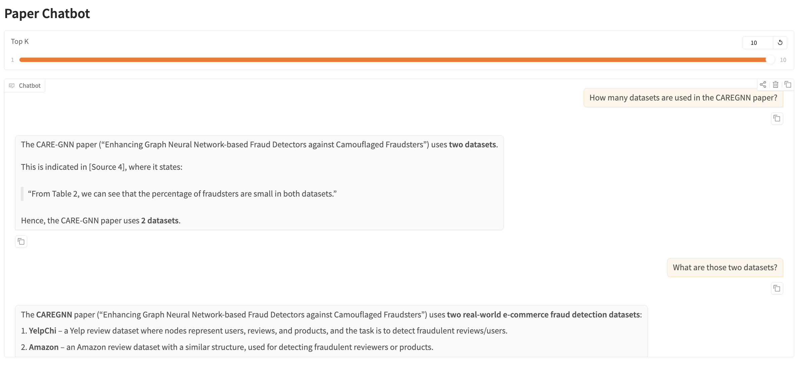

# Paper Chatbot

This project builds a local RAG chatbot over parsed research paper chunks. It:

- Generates OpenAI embeddings for paper chunks and stores them in a local ChromaDB.
- Serves a Gradio web UI to chat with the papers.

The project's code is 100% generated by prompting GPT-5.1-Codex.
It was originally designed for building a chatbot for papers listed in [Awesome Graph/Transformer Fraud Detection](https://github.com/safe-graph/graph-fraud-detection-papers), but one can use it to build any chatbot given pre-chunked corpus.

## Setup

> Use Python 3.11 or 3.12 when creating your virtual environment.

1. Create a virtual environment and install dependencies.

```bash
python -m venv .venv
source .venv/bin/activate
pip install -r requirements.txt
```

2. Set your OpenAI API key (and optional overrides).

```bash
export OPENAI_API_KEY="..."
```

Optional overrides are listed in `.env.example`. If you create a `.env` file in the
project root, it will be loaded automatically.

## The chunked corpus file

Ensure `data/papers.json` exists before building the Chroma index. This repository
does not include a corpus builder script, so generate the file externally or
[download](https://drive.google.com/file/d/1nEq5V6J9WpWjxKdpn15DCjGcItrUEeUm/view?usp=drive_link) a corpus of ~250 fraud-detetion-related papers parsed by [MinerU](https://github.com/opendatalab/MinerU).

## Build the Chroma index

You can either build the chroma index using the following command with any embedding model you choose.
Or you can [download](https://drive.google.com/file/d/15pnd_91SB2aya-yHavbjO9uoxhoPztx8/view?usp=drive_link) a prebuilt Chroma DB based on OpenAI's `text-embedding-3-large`.
Similar to `papers.json`, you need to put the unzipped directory `/chroma` under `/data`.

```bash
python scripts/build_chroma.py --corpus data/papers.json --chroma-dir data/chroma
```

Useful flags:

- `--reset` to rebuild the collection from scratch.
- `--skip-existing` to avoid re-embedding chunks already in Chroma.
- `--batch-size 100` to tune embedding batches.


## Run the chatbot

```bash
python app.py
```

Open the local Gradio URL shown in your terminal.

## Demo

Here is the screenshot of the chatbot using GPT-5.2-Chat



Below is another QA example on comparing two papers.

<details>
<summary><strong>Click to expand</strong></summary>

**user**: Can you summarize the key difference between the two papers? 

1. DiffGAD: A Diffusion-based Unsupervised Graph Anomaly Detector
2. Conditional Diffusion Anomaly Modeling on Graphs

**assistant**: Based on the provided context, the **key difference** between the two papers lies in **how they use diffusion models for graph anomaly detection**—specifically, whether diffusion is used as a *data augmentation and reconstruction tool* (DiffGAD) or as a *direct generative modeling framework for anomaly inference* (CGADM).

---

### **1. DiffGAD: A Diffusion-based Unsupervised Graph Anomaly Detector**

**Core idea:**  
- **Purpose:** Transfers diffusion models from generative tasks to **unsupervised anomaly detection**.  
- **Mechanism:**  
  - Operates in the **latent space** of the graph.  
  - Uses **two diffusion models**: one for general content and one for common content.  
  - The **difference between the two** captures *discriminative content* that helps identify anomalies.  
  - Employs a **content-preservation strategy** to maintain information consistency.  
- **Detection principle:**  
  - Nodes that are **harder to reconstruct** (i.e., with higher reconstruction error) are considered anomalous.  
- **Role of diffusion:**  
  - Diffusion acts as a **reconstruction and feature refinement process** to improve discriminative representation.  
- **Setting:**  
  - **Unsupervised**—no labeled anomalies are required.  
- **Datasets:**  
  - Evaluated on **six real-world, large-scale datasets**.

---

### **2. Conditional Diffusion Anomaly Modeling on Graphs (CGADM)**

**Core idea:**  
- **Purpose:** Introduces a **conditional generative diffusion model** that directly models the **joint distribution of anomalies** on graphs.  
- **Mechanism:**  
  - Incorporates a **prior-guided diffusion process**, where a pre-trained conditional anomaly estimator guides both forward and reverse diffusion.  
  - Uses a **prior confidence-aware mechanism** to adaptively control the number of reverse denoising steps for efficiency.  
- **Detection principle:**  
  - Rather than reconstructing and comparing errors, CGADM **directly generates anomaly judgments** through **joint distribution modeling**.  
- **Role of diffusion:**  
  - Diffusion is used as a **model-centric generative process**, not just for data augmentation or reconstruction.  
- **Setting:**  
  - Focuses on **conditional modeling**—leveraging prior anomaly estimators for guided diffusion.  
- **Datasets:**  
  - Evaluated on **Elliptic, Tolokers, and YelpChi** datasets.

---

### **3. Key Conceptual Difference**

| Aspect | **DiffGAD** | **CGADM** |
|--------|--------------|-----------|
| **Paradigm** | Reconstruction-based, unsupervised detector | Generative, model-centric conditional detector |
| **Diffusion Role** | Used to reconstruct and distill discriminative latent features | Used to model the joint distribution of anomalies directly |
| **Guidance Mechanism** | Dual diffusion models (general vs. common content) | Prior-guided conditional diffusion with adaptive denoising |
| **Detection Basis** | Reconstruction error and discriminative content | Direct anomaly probability estimation from generative model |
| **Supervision** | Unsupervised | Conditional (uses a pre-trained anomaly estimator as prior) |
| **Goal** | Enhance discriminative representation for anomaly detection | Directly generate anomaly judgments through conditional modeling |

---

### **In summary:**
- **DiffGAD** treats diffusion as a **latent-space reconstruction and feature discrimination tool** for unsupervised anomaly detection.  
- **CGADM** redefines diffusion as a **conditional generative modeling framework** that directly infers anomalies by learning their joint distribution with graph structure and features.  

Thus, **DiffGAD = reconstruction-based detector**, while **CGADM = generative, model-centric anomaly modeler**.

</details>
